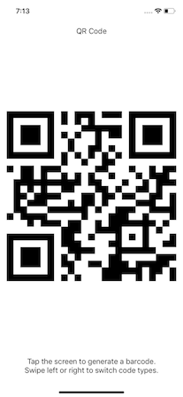

### Bar Code Generator Sample

This is a demo app to illustrate generation of code images in one of 4 different formats: 
- 128 Barcode,
- PDF417 Barcode,
- Aztec Code,
- QR Code. 

The codes are generated from random data based off UUID, but you can easily replace the appropriate type with your own data provider.  

